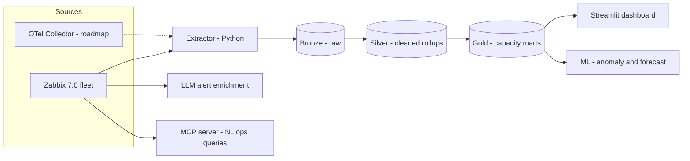

# zabbix-aiops-platform

AIOps and analytics platform built over enterprise fleet telemetry. Extracts
metrics from Zabbix into a warehouse, models them with dbt (medallion
architecture), and layers on LLM-powered alert enrichment, an MCP server for
natural-language ops queries, dashboards, and anomaly detection.

> Status: early scaffold — Project 1 (alert enrichment) in progress.

## Architecture



## Components

| Path | What it is |
|---|---|
| `pipeline/` | Extraction from Zabbix API into the warehouse |
| `alert-enrichment/` | Webhook service: Zabbix alert → LLM triage → Teams |
| `mcp-server/` | MCP tools exposing fleet telemetry to LLM agents |
| `dbt/` | Bronze/silver/gold models + tests |
| `dashboard/` | Streamlit capacity & utilization views |
| `ml/` | Anomaly detection and capacity forecasting |
| `synth/` | Synthetic fleet/data generator for the demo sandbox |

## Quickstart (local sandbox)

Requires Docker Desktop and Python 3.11+.

```bash
git clone <this repo> && cd zabbix-aiops-platform
make sandbox          # Zabbix server + web + one agent, UI at http://localhost:8080 (Admin/zabbix)
make deps             # pip install -r requirements.txt
cp .env.example .env  # then create an API token in the Zabbix UI and paste it in
make hosts            # smoke test: lists hosts via the API
```

Running against a real fleet is the same code — only `.env` changes.

## Design notes

Architecture decisions are recorded in [`docs/adr/`](docs/adr/). Start with
ADR-001 on pluggable telemetry sources.
